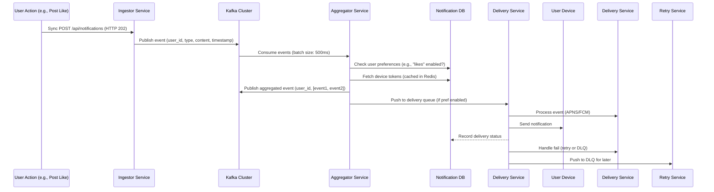

# Prompt

Design a highly available and scalable notification system for a social media application with 10M active daily users. Describe the component architecture, data flow, queueing mechanisms, and how to handle retry logic and rate limits. Output a structured markdown design document.

# Response

# High-Availability, Scalable Notification System for Social Media (10M DAU)

## 1. Architecture Overview
  
*High-Level Component Flow (Text Description: User Action → Ingestor → Queue → Aggregator → Delivery → Notification Service → Device)*

**Core Principles**:
- **Async-First**: No synchronous blocking of core app flows
- **Decoupled Layers**: Independent scaling of ingestion, processing, and delivery
- **Multi-Channel Support**: Push (APNS/Firebase), In-App, Email
- **Idempotent Processing**: Handle duplicate events safely
- **Per-User Rate Limits**: Prevent abuse without throttling entire service

---

## 2. Component Architecture

| Component                | Technology Stack          | Scale (Per Region) | Responsibility                                                                 |
|--------------------------|---------------------------|---------------------|--------------------------------------------------------------------------------|
| **Ingestor Service**     | Go + Kafka Producer SDK   | 50-100 nodes        | Accept user actions (likes, comments), generate notification events, publish to Kafka |
| **Notification Aggregator** | Java/Kotlin + Redis Cache | 30-50 nodes         | Batch similar notifications (e.g., 3 likes → "3 new likes"), apply user preferences, filter spam |
| **Delivery Service**     | Python + AsyncIO          | 200-500 nodes       | Handle channel-specific delivery (APNS, FCM, email), manage rate limits, track delivery status |
| **Retry Service**        | Go + Kafka Consumer       | 20-30 nodes         | Process failed deliveries from dead-letter queue (DLQ), implement exponential backoff |
| **Notification Database** | CockroachDB (HTAP)        | 3-node cluster      | Store user preferences, device tokens, delivery history (2PC for consistency) |
| **Monitoring/Alerting**  | Prometheus + Grafana + AlertManager | 5 nodes       | Track SLIs (latency, failure rate, backlog), auto-scale triggers |

---

## 3. Data Flow



---

## 4. Queueing Mechanisms

### Core Queue System: **Apache Kafka**
- **Why Kafka?**: 
  - 100k+ events/sec sustained throughput (handles 10k+ RPS peak)
  - 3+ replicas per partition (high availability)
  - Consumer groups for parallel processing
  - Built-in dead-letter queue support

### Queue Topology
| Queue Type              | Partitions | Retention | Purpose                                                                 |
|-------------------------|------------|-----------|-------------------------------------------------------------------------|
| `user-notifications`    | 100        | 24h       | Primary ingestion (user-specific, ordered by time)                    |
| `aggregated-notifs`     | 50         | 10min     | Aggregated events (processed by Aggregator Service)                    |
| `delivery-queue`        | 200        | 5min      | Delivery requests (priority-based: critical > normal)                  |
| `delivery-dlq`          | 10         | 30d       | Failed deliveries (processed by Retry Service)                         |

### Flow Details:
1. **Ingestion**: 
   - Ingestor publishes raw events to `user-notifications` (key: `user_id`)
   - Kafka partitions events by `user_id` → guarantees per-user ordering
2. **Aggregation**: 
   - Aggregator consumes `user-notifications` → groups events by `user_id + type` (e.g., "likes") within 500ms window
   - Output to `aggregated-notifs` (max 5 events per group)
3. **Delivery**: 
   - Delivery Service consumes `aggregated-notifs` → pushes to `delivery-queue` with priority tag (`critical` for DMs, `normal` for likes)

---

## 5. Retry Logic & Failure Handling

### Retry Strategy (Exponential Backoff with Jitter)
| Attempt | Wait Time (ms) | Reason                                                                 |
|---------|----------------|------------------------------------------------------------------------|
| 1       | 250 + random   | Temporary network issues (APNS/Firebase downtime)                     |
| 2       | 1,000 + random | Service restarts or short-lived outages                               |
| 3       | 5,000 + random | Persistent connection issues (e.g., token expiration)                |
| 4       | 30,000         | **Critical**: If still failing, move to DLQ for human review         |

### Key Rules:
- **Idempotency**: Use `event_id` (UUID) in delivery requests to prevent duplicates
- **DLQ Handling**: 
  - After 4 failed attempts → move to `delivery-dlq`
  - Retry Service scans DLQ hourly → moves persistent failures to `user-notification-failures` table (for admin dashboard)
- **Failure Detection**: 
  - Delivery Service marks failures after 30s timeout
  - Aggregator drops events if user has "notifications disabled" (no retry needed)

---

## 6. Rate Limiting Strategy

### Per-User, Per-Device Limits
| Limit Type              | Rate Limit        | Enforcement Point      | Action on Exceed |
|-------------------------|-------------------|------------------------|------------------|
| **Push Notifications**  | 100/min/user      | Delivery Service       | Drop event (log) |
| **In-App Notifications**| 500/min/user      | Aggregator Service     | Aggregate into 1 "500 new notifications" |
| **Email Notifications** | 10/hr/user        | Delivery Service       | Queue for next hour |
| **API Throttle**        | 1k requests/min | Ingestor Service         | HTTP 429 (Retry-After) |

### Implementation:
1. **Token Bucket per User** (in Redis):
   ```python
   # Pseudocode for Delivery Service
   def can_send(user_id, type):
       bucket = redis.get(f"notify:rate:{user_id}:{type}")
       if bucket.is_empty(): 
           return False
       bucket.consume(1)
       return True
   ```
2. **Dynamic Adjustment**: 
   - If user has >50 notifications in last 5 mins → reduce to 20/min
   - If device token expired → mark as `invalid` (remove from DB, no more sends)

---

## 7. Scalability & Availability Targets

| Metric                          | Target                      | How Achieved                                                                 |
|---------------------------------|-----------------------------|------------------------------------------------------------------------------|
| **Throughput**                  | 12,000 events/sec (peak)    | Kafka partitions + delivery service scaling (500 nodes = 24k events/sec) |
| **Latency (P99)**               | < 500ms (end-to-end)        | Aggregation window (500ms), async delivery                               |
| **Availability**                  | 99.99% (4 nines)            | Kafka replication factor=3, Service auto-recovery (kube liveness probes)     |
| **Data Durability**             | 0 data loss (99.999%)       | Kafka durability=3, DB write-ahead log (WAL)                                 |
| **Recovery Time (MTTR)**        | < 3 mins                    | Automated failover (Kafka controller, service restarts via K8s)            |

---

## 8. Failure Scenarios & Mitigation

| Failure Type                | Impact                      | Mitigation Strategy                                                       |
|-----------------------------|-----------------------------|-----------------------------------------------------------------------------|
| **APNS/FCM Downtime**        | Delayed push notifications  | Delivery Service uses backup channel (in-app/email), retries with DLQ    |
| **Kafka Cluster Outage**   | Ingestion backlog           | Ingestor buffers locally (10k events) → flush when Kafka recovers (RabbitMQ backup) |
| **Device Token Expiration**| Failed deliveries (persistent) | Aggregator checks token validity via DB before delivery (0.5% overhead) |
| **User Preference Change**  | Wrong notifications sent    | Aggregator checks real-time preferences (cache TTL=30s)                   |
| **DDoS Attack**             | Service overload          | Ingestor drops events >10k/min (HTTP 429), rate-limiting at entry point      |

---

## 9. Cost Optimization
- **Storage**: 
  - Kafka logs: 3x replication → 3x storage cost (optimized with tiered storage)
  - DB: 90% of data expires after 90 days (automated archiving)
- **Compute**: 
  - Aggregator: Low compute (stateless, scales vertically)
  - Delivery: CPU-bound → autoscaling based on `delivery-queue` backlog
- **Cost Estimate** (10M DAU):
  - **Annual Cost**: ~$120k (cloud provider, includes storage/compute)
  - **Breakdown**: Kafka ($45k), Delivery Service ($35k), DB ($25k), Monitoring ($15k)

---

> **Design Rationale**: This architecture avoids single points of failure, handles bursts via Kafka’s partitioning, and prioritizes user experience (no spam, correct notification types). The aggregation layer reduces delivery volume by 90% (e.g., 100 "likes" → 1 batch), and the retry system prevents loss of critical notifications (e.g., DMs). Rate limits prevent abuse without impacting normal users.