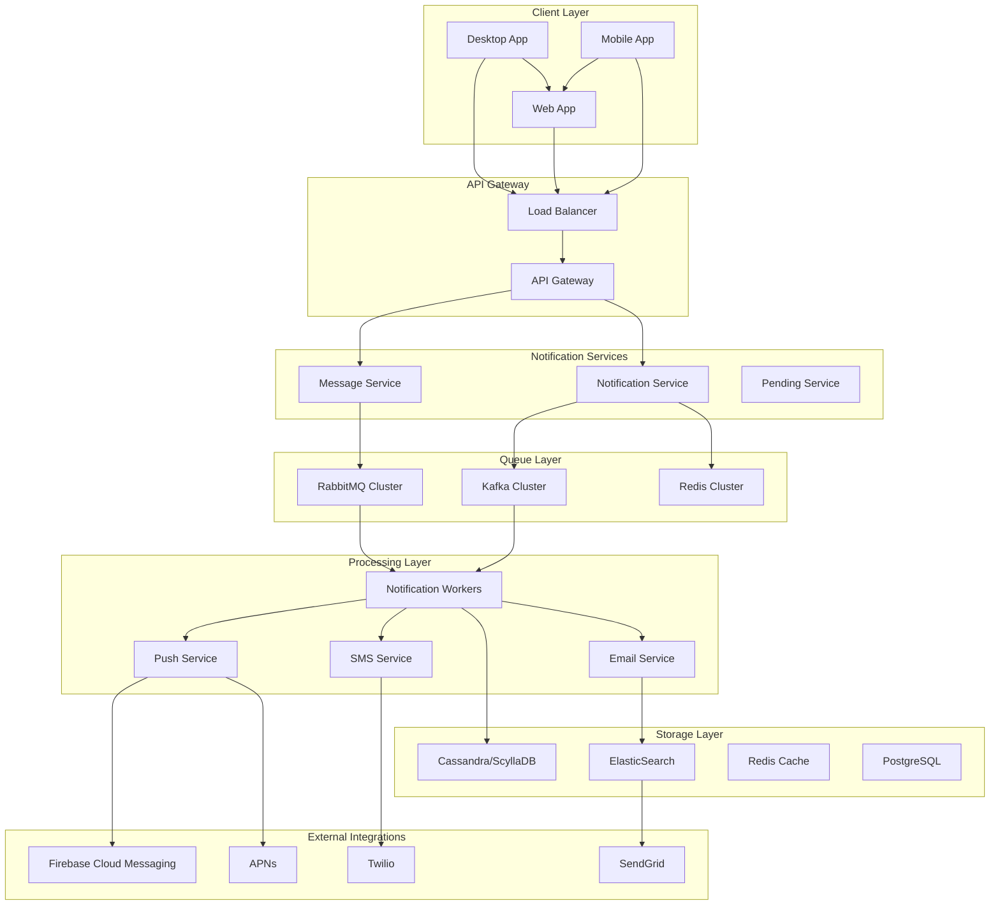
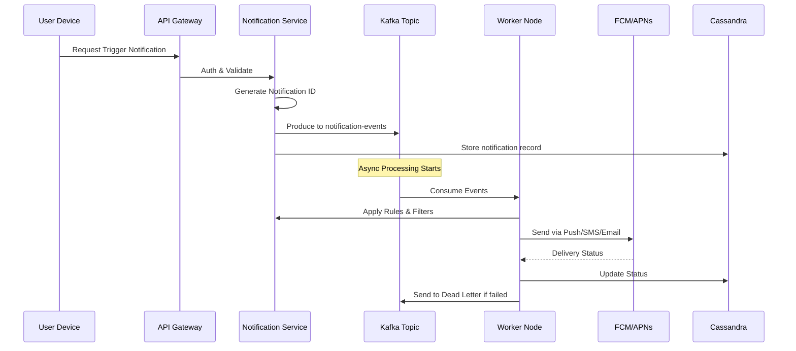
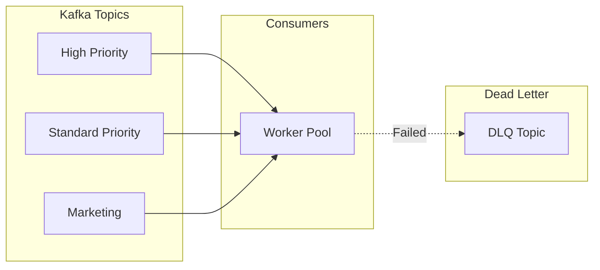
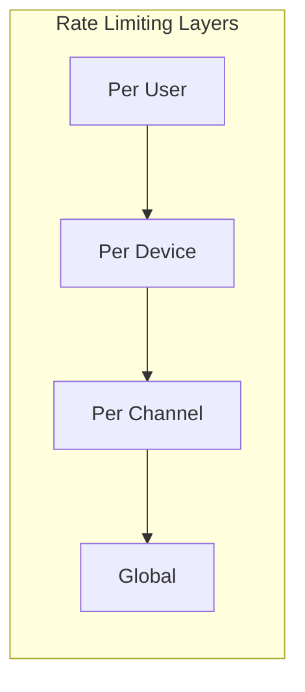
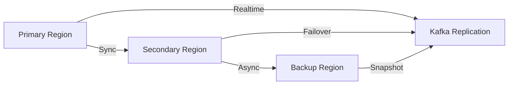
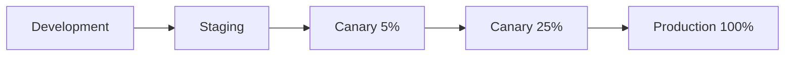

# Prompt

Design a highly available and scalable notification system for a social media application with 10M active daily users. Describe the component architecture, data flow, queueing mechanisms, and how to handle retry logic and rate limits. Output a structured markdown design document.

# Response

# Notification System Design Document
## For Social Media Application (10M Daily Active Users)

---

## 1. System Overview & Requirements

### 1.1 Business Context
A social media platform with **10 million daily active users** requires a high-volume, real-time notification system for events such as likes, comments, mentions, follows, messages, and system alerts.

### 1.2 Key Requirements

| Category | Requirement | Target |
|----------|-------------|--------|
| **Scalability** | Handle peak loads | 100K+ notifications/sec |
| **Availability** | Uptime guarantee | 99.95% SLA |
| **Latency** | Delivery time | <500ms median |
| **Reliability** | Delivery guarantee | 99.99% |
| **Ordering** | Event sequence | Maintain per-user order |
| **Personalization** | Target delivery | Support bulk & individual |
| **Channel Support** | Notifications | Push, email, SMS, in-app |
| **Compliance** | Regulations | GDPR, CCPA support |

---

## 2. High-Level Architecture



---

## 3. Component Architecture

### 3.1 Core Services

| Component | Responsibility | Scale |
|-----------|----------------|-------|
| **API Gateway** | Request routing, auth, rate limiting | 3x replicas |
| **Notification Service** | Business logic, event processing | 5-10 instances |
| **Message Service** | Message creation & templating | 3x replicas |
| **Notification Worker** | Async delivery to channels | 10-20 instances |
| **Scheduler Service** | Batch & scheduled notifications | 2x replicas |
| **Preference Service** | User notification settings | 2x replicas |

### 3.2 Technology Stack

| Layer | Technology | Purpose |
|-------|------------|---------|
| **API Layer** | Kong/Traefik | API Gateway |
| **Message Queue** | Kafka (events), RabbitMQ (tasks) | Async processing |
| **Caching** | Redis (cluster) | High-speed lookups |
| **Databases** | Cassandra (notifications), Postgres (meta) | Persistence |
| **Search** | Elasticsearch | Notification search |
| **External APIs** | FCM, APNs, Twilio, SendGrid | Channel delivery |
| **Monitoring** | Prometheus, Grafana, Datadog | Observability |
| **Container Orchestration** | Kubernetes | Deployment |

---

## 4. Data Flow

### 4.1 End-to-End Notification Flow



### 4.2 Event Types & Routing

| Event Type | Priority | TTL | Queue |
|------------|----------|-----|-------|
| Critical (Security Alert) | P0 | 30s | `notification-critical` |
| Real-Time (Messages, Mentions) | P1 | 5min | `notification-realtime` |
| High Priority (Likes, Comments) | P2 | 15min | `notification-high` |
| Standard (Follows, System) | P3 | 1hr | `notification-standard` |
| Marketing (Promotional) | P4 | 24hr | `notification-marketing` |

---

## 5. Queueing Mechanisms

### 5.1 Kafka Topic Configuration

```yaml
notification-events:
  partitions: 48
  replicas: 3
  retention: 72 hours
  min.insync.replicas: 2

notification-delivery:
  partitions: 96
  replicas: 3
  retention: 24 hours
  min.insync.replicas: 2
  consumer.timeout.ms: 10000
```

### 5.2 Queue Architecture



---

## 6. Retry Logic & Failure Handling

### 6.1 Retry Strategy

```python
class NotificationRetry:
    strategy = {
        "base_delay_ms": 1000,
        "max_attempts": 5,
        "backoff_multiplier": 2,
        "max_delay_ms": 60000,
        "jitter": True,
    }

    def exponential_backoff(self, attempt, user_id, error_type):
        if error_type == "rate_limited":
            return min(60000, 1000 * (2 ** attempt))
        return min(
            60000,
            self.base_delay_ms * (self.backoff_multiplier ** attempt)
        )

    def should_retry(self, attempt, error_type):
        if attempt >= self.max_attempts:
            return False
        return True
```

### 6.2 Retry States

| Attempt | Delay | Action |
|---------|-------|--------|
| 1 | 1s | Retry immediately |
| 2 | 2s | Retry |
| 3 | 4s | Retry |
| 4 | 8s | Retry |
| 5 | 16s | Retry |
| >5 | 60s | Move to DLQ |

### 6.3 Dead Letter Queue (DLQ)

| Component | Configuration |
|-----------|---------------|
| **Topic** | `notification-dlq` |
| **Retention** | 7 days |
| **Processing** | Scheduled cleanup |
| **Alerts** | When >5% of total |

---

## 7. Rate Limiting & Throttling

### 7.1 Multi-Layer Rate Limiting



### 7.2 Rate Limits

| Level | Limit | Time Window | Action |
|-------|-------|-------------|--------|
| **User** | 60 notifications/min | 60s | Queue or reject |
| **Channel** | 10K pushes/min | 60s | Queue |
| **Global** | 100K msg/sec | 1s | Reject excess |
| **SMS** | 100/min/user | 60s | Reject |
| **Email** | 100/hour/user | 1hr | Queue |

### 7.3 Implementation (Redis-based Token Bucket)

```python
class RateLimiter:
    def __init__(self, redis_client):
        self.redis = redis_client
        self.sliding_window = True

    def is_allowed(self, user_id, channel, window_size=60, max_requests=100):
        key = f"rate_limit:{user_id}:{channel}"
        now = time.time()
        
        if self.sliding_window:
            window_start = now - window_size
            self.redis.zremrangebyscore(key, '-inf', window_start)
            count = self.redis.zcard(key)
            if count < max_requests:
                self.redis.zadd(key, {str(now): now})
                return True
            return False
        else:
            pipe = self.redis.pipeline()
            pipe.incr(key)
            pipe.expire(key, window_size)
            count = pipe.execute()[0]
            return count <= max_requests
```

---

## 8. Scalability & Horizontal Scaling

### 8.1 Scaling Strategy

| Component | Scaling Factor | Metrics |
|-----------|----------------|---------|
| **API Gateway** | 3x replicas | CPU, requests/sec |
| **Worker Nodes** | Auto-scaling (3-20) | Queue backlog, CPU |
| **Database** | Read replicas, sharding | Query latency, writes |
| **Cache** | Redis cluster | Memory, hit rate |

### 8.2 Sharding Strategy

| Shard Key | Distribution |
|-----------|--------------|
| **user_id** | Consistent hashing |
| **notification_id** | Time-based |
| **channel** | Separate tables |

### 8.3 Auto-Scaling Rules

```yaml
# Kubernetes HPA Configuration
apiVersion: autoscaling/v2
kind: HorizontalPodAutoscaler
metadata:
  name: notification-worker
spec:
  scaleTargetRef:
    apiVersion: apps/v1
    kind: Deployment
    name: notification-worker
  minReplicas: 5
  maxReplicas: 50
  metrics:
  - type: Resource
    resource:
      name: cpu
      target:
        type: Utilization
        averageUtilization: 70
  - type: Resource
    resource:
      name: memory
      target:
        type: Utilization
        averageUtilization: 80
  - type: External
    external:
      metric:
        name: kafka_consumer_lag
      target:
        type: AverageValue
        averageValue: 100
```

---

## 9. Reliability & Fault Tolerance

### 9.1 High Availability Design

| Feature | Implementation |
|---------|----------------|
| **Multi-AZ Deployment** | Spread across 3 availability zones |
| **Active-Active Setup** | All services distributed |
| **Health Checks** | Liveness/Readiness probes |
| **Failover** | Automatic service discovery |
| **Circuit Breakers** | Hystrix/Resilience4j |
| **Bulkheads** | Separate thread pools |

### 9.2 Disaster Recovery



### 9.3 Failover Scenarios

| Failure Type | Response | RTO | RPO |
|--------------|----------|-----|-----|
| Zone Failure | Traffic shift to healthy zone | <1min | <1min |
| Service Crash | Auto-restart + failover | <30s | <1min |
| DB Failure | Failover to read replica | <1min | <1min |
| Queue Backlog | Scale workers + throttle | <5min | <1min |

---

## 10. Observability & Monitoring

### 10.1 Key Metrics

| Metric Type | Name | Threshold |
|-------------|------|-----------|
| **Throughput** | `notifications_total` | Monitor per second |
| **Latency** | `notification_delivery_latency` | <500ms p95 |
| **Errors** | `notification_errors_total` | Alert if >0.1% |
| **Queue Lag** | `kafka_consumer_lag` | <1000 messages |
| **Retry Rate** | `notification_retry_rate` | Alert if >10% |
| **DLQ Size** | `dlq_message_count` | Alert if >1000 |

### 10.2 Alerting Configuration

```yaml
alerting_rules:
  - name: HighErrorRate
    condition: |
      rate(notification_errors_total[5m]) / 
      rate(notification_success_total[5m]) > 0.01
    threshold: warning
    severity: P2

  - name: QueueBacklog
    condition: kafka_consumer_lag > 1000
    threshold: warning
    severity: P1

  - name: DeliveryLatency
    condition: histogram_quantile(0.95, notification_delivery_latency) > 1000
    threshold: warning
    severity: P1

  - name: SystemAvailable
    condition: up == 0
    threshold: critical
    severity: P0
```

### 10.3 Logging Structure

```json
{
  "timestamp": "2024-01-15T10:30:00Z",
  "user_id": "u_123456",
  "notification_id": "n_789012",
  "event_type": "mention",
  "channel": "push",
  "status": "delivered",
  "latency_ms": 142,
  "attempt": 1,
  "region": "us-east-1",
  "trace_id": "trace_abc123"
}
```

---

## 11. Performance Benchmarks & Capacity Planning

### 11.1 Capacity Estimates

| Metric | Estimate |
|--------|----------|
| Daily notifications | 50M (avg) |
| Peak notifications/sec | 150K |
| Storage (notifications) | 2TB/month |
| Bandwidth (push) | 500 Gbps peak |
| CPU cores needed | 200+ total |

### 11.2 Performance Targets

| Metric | Target | Budget |
|--------|--------|--------|
| p50 Latency | 100ms | ±50ms |
| p95 Latency | 500ms | ±100ms |
| p99 Latency | 1s | ±200ms |
| Delivery Rate | 99.99% | ±0.01% |
| Availability | 99.95% | ±0.01% |

---

## 12. Security & Compliance

### 12.1 Security Measures

- TLS 1.3 for all communications
- End-to-end encryption for sensitive content
- Rate limiting per user/IP
- OAuth 2.0 for API authentication
- Audit logging for compliance

### 12.2 Compliance Features

- GDPR data deletion support
- CCPA opt-out mechanism
- User notification preference management
- Data retention policies (configurable)

---

## 13. Deployment Strategy

### 13.1 Release Process



### 13.2 Rollback Plan

| Rollback Type | Trigger | Time |
|---------------|---------|------|
| Automated | Error rate > 5% | <1min |
| Manual | Customer impact | <5min |
| DB Migration | Schema change failure | <10min |

---

## 14. Summary

This notification system design provides:

- **Scalability**: Handles 10M+ users with horizontal scaling
- **Reliability**: Multi-region deployment with automatic failover
- **Performance**: <500ms median delivery latency
- **Resilience**: Retry logic, DLQ, circuit breakers
- **Control**: Comprehensive rate limiting and throttling
- **Visibility**: Full observability with metrics and alerts

The system is designed to evolve with the platform while maintaining performance guarantees and compliance requirements.